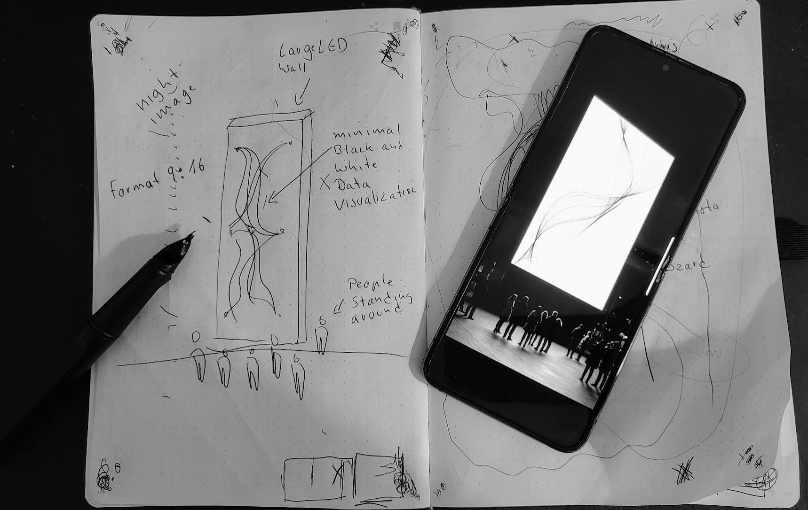

# InkLogic (Prototype)

Work in progress prototype connecting paper Smartpen Notebooks to generative AI.

## Setup
1. `npm install`
2. `npm start`

## Usage
- Enter Gemini API Key in Settings.
- Connect pen.
- Define trigger boxes for Text/Image on paper.
- Draw and check boxes to activate.

## Notes
- Images saved to `generated_images/`.
- Browser preview at `http://localhost:3000`.
- Dark mode only.
